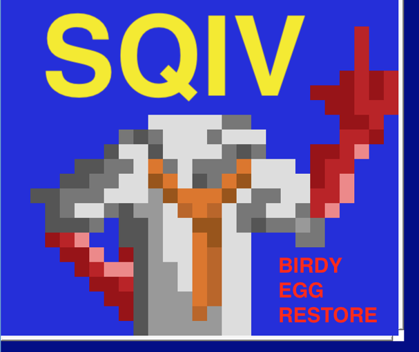
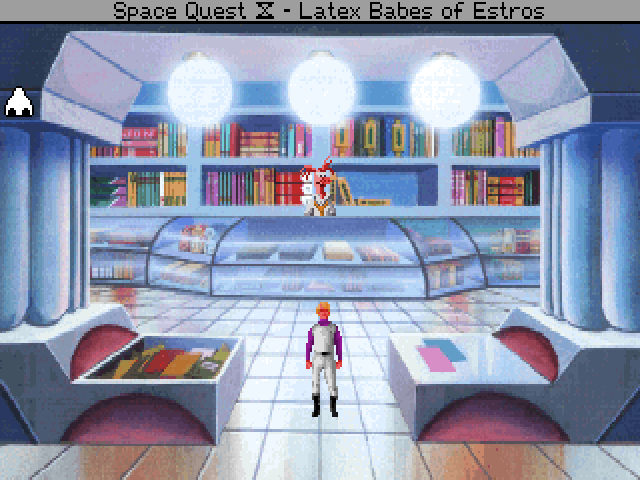
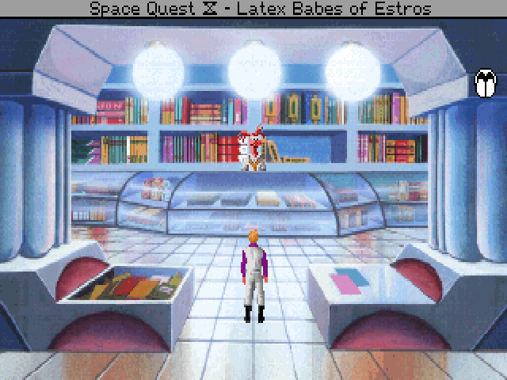

# SQ4CDBirdyEggRestoration

version 0.3 

 Restores both software store easter eggs in the CD version of SQ4 and prevents trigging both at the same time, avioding lock up. Todo: Convert box or birdy to ego script so both are possible at the same time.

INSTALLATION

Copy the 397.hep, 397.scr and 397.v56 files into your SQIV game folder.

Smell the left wall square and then face directly south.

Taste the right wall square.

https://github.com/Doomlazer/SQ4CDBirdyEggRestore
