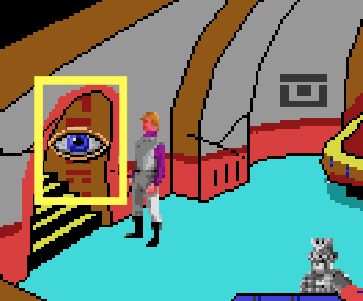
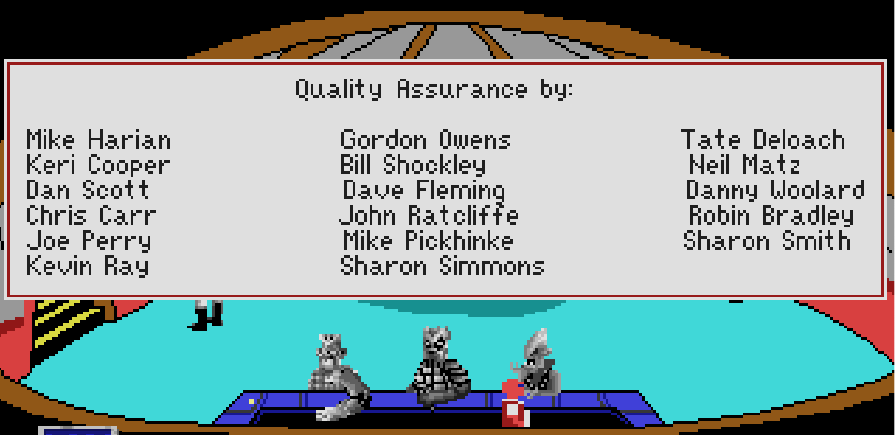

# SQ4CDBirdyEggRestore

## version 0.6

Versions 0.3 and 0.4 had crashes - Please update to 0.5.1

I've confirmed both easter eggs are now fulling working in SCUMMVM 2.2.0 (works with text, voice, or both) and DOSBox 0.74-3 (text or speech). This 'should' be the final version of the patches, but please report any issues!

Restores both software store easter eggs in the CD version of SQ4. Also fixes the Floppy version lockup when both eggs are executed at the same time. 

## INSTALLATION

Copy the 397.hep, 397.scr and 397.v56 files into your SQIV game folder.

In version 0.6, I've added the Ulence Flats' bar easter egg. Copy 615.hep, 615.src and 615.msg to install that egg as well.

Smell the left wall square and then face directly south.

Taste the right wall square.

(<a href="https://www.benshoof.org/blog/space-quest-iv-easter-eggs" target="_blank">Gif source</a>)

The Ulence Flats Bar Easter Egg is triggered by looking at the alien writing in the doorway Six (6) times. 

It displays a list of Quality Assurance testers (Since Gary Owens did not record audio for these messages they appear as text only). The formatting isn't 100% accurate becuase of changes in the code between SQ4 Floppy and SQ4CD versions, but it's close enough for now I guess. 

https://github.com/Doomlazer/SQ4CDBirdyEggRestoration
