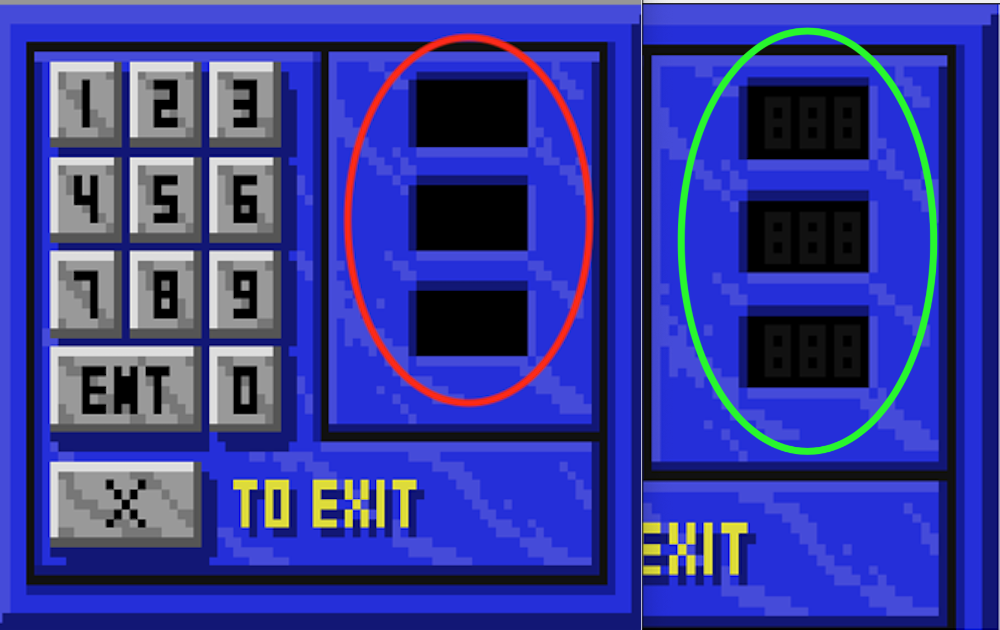

# SQ4CDBirdyEggRestore

Restores both software store easter eggs in the CD version of SQ4. Also fixes the Floppy version lockup when both eggs are executed at the same time. 

Version 0.6: Added Ulence Flats Easter Egg.

Version 0.7: Added fix KeyPad graphical issue.

## INSTALLATION

Copy the desired patches into the SQ4CD game folder.

Software Store patches: 397.hep, 397.scr and 397.v56.

Ulence Flats' bar patches: 615.hep, 615.src and 615.msg.

KeyPad patch: 502.v56

## Changes

Smell the left wall square and then face directly south.

Taste the right wall square.

(<a href="https://www.benshoof.org/blog/space-quest-iv-easter-eggs" target="_blank">Gif source</a>)

The Ulence Flats Bar Easter Egg is triggered by looking at the alien writing in the doorway Six (6) times. 

It displays a list of Quality Assurance testers (Since Gary Owens did not record audio for these messages they appear as text only). The formatting isn't 100% accurate becuase of changes in the code between SQ4 Floppy and SQ4CD versions, but it's close enough for now I guess. 

In the "Laserbeam hallway", the keypad numbers don't display 000 correctly until a number is entered. After looking at the code in room 541, there isn't really a way to correct this programatically. The easy way to fix the issue is to just draw the dark grey "000" into view 502.

https://github.com/Doomlazer/SQ4CDBirdyEggRestoration
